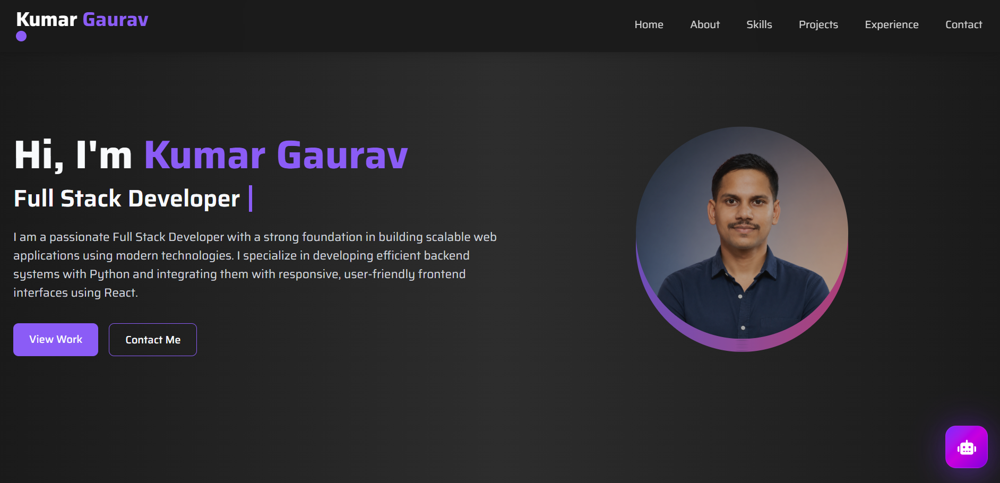
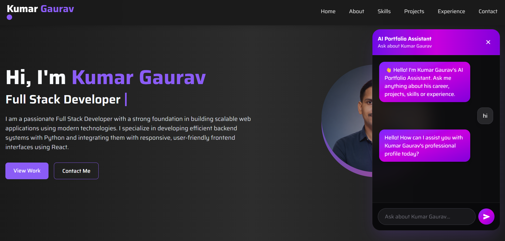

# 🤖 AI Portfolio Assistant

An AI-powered portfolio chatbot that enables recruiters, hiring managers, and visitors to interact with my portfolio using natural language. Instead of manually browsing my resume, users can ask questions about my education, skills, projects, certifications, experience, or request my GitHub, LinkedIn, and portfolio links. The assistant leverages **Large Language Models (LLMs)**, **tool calling**, and **streaming responses** to provide fast and accurate answers.

---

## 🚀 Live Demo

🌐 **Portfolio:** https://kumargaurav-portfolio.vercel.app

---

# ✨ Features

- 🤖 AI-powered portfolio assistant
- 💬 Real-time streaming responses
- 📄 Resume parsing and structured data extraction
- 🛠️ LLM Tool Calling
- 📚 Resume search functionality
- 🔗 GitHub, LinkedIn & Portfolio link retrieval
- ⚡ FastAPI REST API
- 🎨 Modern glassmorphism chat UI
- 🌙 Dark theme with purple gradient
- 📱 Fully responsive design
- 🔄 Reset conversation
- ☁️ Deployed on Vercel & Render

---

# 🛠️ Tech Stack

## Frontend

- React
- Vite
- Tailwind CSS
- Framer Motion
- Axios
- React Markdown
- Remark GFM
- React Icons

## Backend

- FastAPI
- Python
- Uvicorn
- Pydantic
- python-dotenv

## AI

- Groq API
- Llama 3.3 70B Versatile
- Tool Calling
- Prompt Engineering
- Streaming Responses

## Deployment

- Vercel
- Render

---

## Images
#### Home Page

### ChatBot


# 📁 Project Structure

```text
Portfolio/
│
├── backend/
│   ├── app/
│   │   ├── api/
│   │   ├── core/
│   │   ├── models/
│   │   ├── services/
│   │   └── ...
│   │
│   ├── resume/
│   │   └── kumargaurav.pdf
│   │
│   ├── main.py
│   ├── requirements.txt
│   └── .env.example
│
├── frontend/
│   ├── src/
│   │   ├── components/
│   │   ├── services/
│   │   ├── assets/
│   │   └── ...
│   │
│   ├── package.json
│   ├── vite.config.js
│   └── .env.example
│
└── README.md
```

---

# 🏗️ Architecture

```text
                    User
                      │
                      ▼
             React Chat Widget
                      │
             Axios / Fetch API
                      │
                      ▼
             FastAPI Backend
                      │
          ┌───────────┴───────────┐
          ▼                       ▼
     Portfolio Agent        Resume Parser
          │
          ▼
     Tool Calling
          │
   ┌──────┴─────────┐
   ▼                ▼
Search Resume     Get Links
          │
          ▼
     Groq LLM
          │
          ▼
 Streaming Response
          │
          ▼
      React UI
```

---

# ⚙️ API Endpoints

| Method | Endpoint | Description |
|--------|----------|-------------|
| POST | `/chat` | Returns AI response |
| POST | `/chat/stream` | Streams AI response |
| POST | `/chat/reset` | Resets conversation |

---

# 📦 Installation

## 1. Clone Repository

```bash
git clone https://github.com/Kumar24Gaurav/Portfolio.git

cd Portfolio
```

---

# ⚙️ Backend Setup

```bash
cd backend

python -m venv .venv
```

### Activate Virtual Environment

Windows

```bash
.venv\Scripts\activate
```

Linux / macOS

```bash
source .venv/bin/activate
```

### Install Dependencies

```bash
pip install -r requirements.txt
```

### Create `.env`

```env
GROQ_API_KEY=YOUR_GROQ_API_KEY

ALLOWED_ORIGINS=http://localhost:5173
```

### Run Backend

```bash
uvicorn main:app --reload
```

Backend:

```
http://localhost:8000
```

Swagger:

```
http://localhost:8000/docs
```

---

# 💻 Frontend Setup

```bash
cd frontend

npm install
```

### Create `.env`

```env
VITE_API_URL=http://localhost:8000
```

### Run

```bash
npm run dev
```

Frontend:

```
http://localhost:5173
```

---

# 🚀 Deployment

## Backend (Render)

### Root Directory

```
backend
```

### Build Command

```bash
pip install -r requirements.txt
```

### Start Command

```bash
uvicorn main:app --host 0.0.0.0 --port $PORT
```

### Environment Variables

```env
GROQ_API_KEY=YOUR_GROQ_API_KEY

ALLOWED_ORIGINS=https://your-vercel-app.vercel.app
```

---

## Frontend (Vercel)

Environment Variable

```env
VITE_API_URL=https://your-backend.onrender.com
```

Deploy directly from GitHub.

---

# 📸 Screenshots

## Portfolio

```
images/home.png
```

## Chat Assistant

```
images/chat.png
```

## Streaming Response

```
images/streaming.png
```

## Swagger API

```
images/swagger.png
```

---

# 🎯 Future Improvements

- Voice interaction
- Multi-language support
- Resume upload
- Conversation memory per user
- Authentication
- Suggested prompts
- Chat export
- Admin analytics
- Dark/Light themes

---

# 📚 Learning Outcomes

This project demonstrates practical experience with:

- Large Language Models (LLMs)
- Prompt Engineering
- Tool Calling
- FastAPI
- REST APIs
- Streaming Responses
- React
- Tailwind CSS
- Framer Motion
- API Integration
- Resume Parsing
- Environment Variables
- CORS Configuration
- Git & GitHub
- Render Deployment
- Vercel Deployment

---

# 👨‍💻 Author

**Kumar Gaurav**

- 🌐 Portfolio: https://kumargaurav-portfolio.vercel.app
- 💼 LinkedIn: https://www.linkedin.com/in/kumar-gaurav-814a58299
- 💻 GitHub: https://github.com/Kumar24Gaurav

---

# ⭐ Support

If you found this project useful, consider giving it a ⭐ on GitHub.