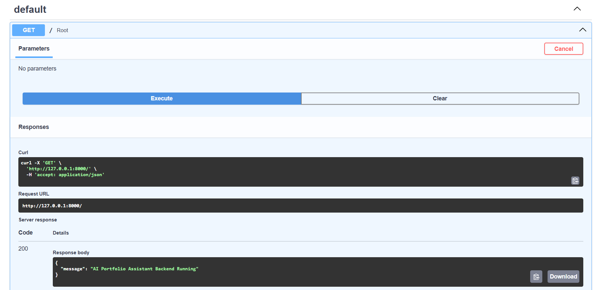
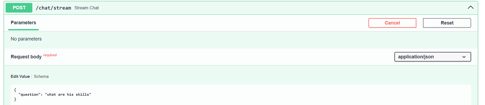
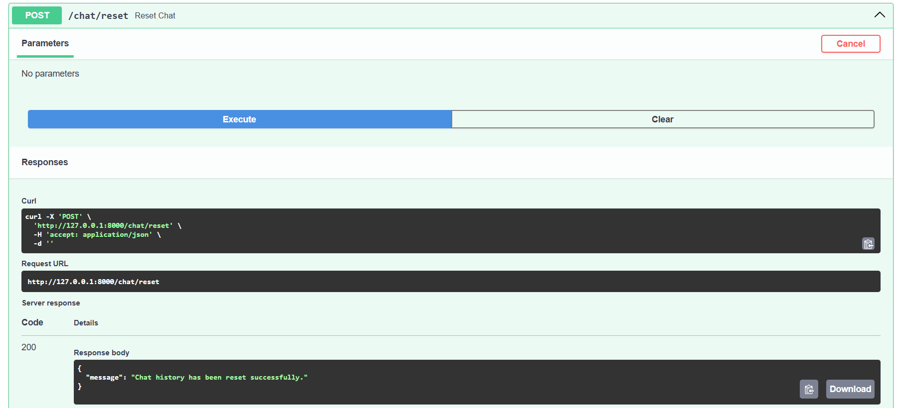
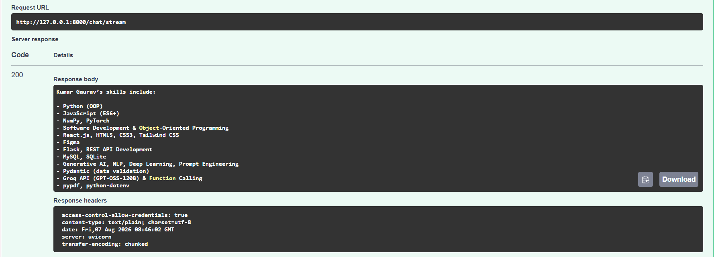

# AI Portfolio Assistant Backend

## 🚀 Overview

This backend powers the AI Portfolio Assistant for Kumar Gaurav. It provides a FastAPI service that reads a resume file, parses it with a Groq-backed LLM, and answers portfolio-focused questions using a tool-enabled chat flow.

The backend is designed to:
- parse a resume from PDF or DOCX
- maintain chat history for follow-up questions
- call tool functions for resume search and link lookup
- expose both normal and streaming chat endpoints

---

## 📁 Folder Structure

```text
backend/
│
├── app/
│   ├── api/
│   │   └── chat_routes.py         # FastAPI router for chat endpoints
│   ├── core/
│   │   ├── config.py              # Groq client and model configuration
│   │   ├── metadata.py            # Static links and project metadata
│   │   └── prompts.py             # System and parser prompts for the assistant
│   ├── models/
│   │   ├── chat_models.py         # Pydantic request/response models
│   │   └── resume_models.py       # Parsed resume data models
│   └── services/
│       ├── portfolio_agent.py     # Agent implementation and LLM orchestration
│       ├── resume_parser.py       # Resume parsing using the LLM
│       ├── resume_reader.py       # Resume file reading from PDF or DOCX
│       └── tools.py               # Tool functions used by the agent
│
├── resume/                        # Stored resume file(s)
│   └── kumargaurav.pdf
│
├── main.py                        # Application entry point
├── requirements.txt               # Python dependencies
├── .env.example                   # Example environment variables
├── test_agent.py                  # Basic backend test or agent runner
└── .venv/                         # Local virtual environment (ignored normally)
```

---

## ⚙️ Workflow

1. `main.py` starts the FastAPI app and loads CORS settings.
2. The `/chat` router in `app/api/chat_routes.py` handles user requests.
3. `PortfolioAssistant` in `app/services/portfolio_agent.py` loads the resume text and extracts structured data.
4. The assistant sends messages to the Groq chat API with a system prompt and available tools.
5. If the model decides to call a tool, the backend executes it and returns the final answer.
6. Streaming chat endpoints send partial AI output back to the client in real time.

---

## 🧩 Key Features

- **Tool-enabled chat** with resume search and portfolio link functions
- **Resume parsing** into structured JSON using a custom prompt and schema
- **Supports PDF and DOCX resumes**
- **Streaming responses** for chat UI integration
- **CORS-ready** for frontend consumption

---

## Images
#### GET

#### POST - Stream


#### POST - Reset_chat



---

## 📥 Installation

### 1. Create a virtual environment

```bash
cd backend
python -m venv .venv
```

### 2. Activate the environment

On Windows:
```powershell
.\.venv\Scripts\Activate.ps1
```

On macOS / Linux:
```bash
source .venv/bin/activate
```

### 3. Install dependencies

```bash
pip install -r requirements.txt
```

### 4. Configure environment variables

Copy the example file and update the API key and allowed origins:

```bash
copy .env.example .env
```

Then open `.env` and set:
- `GROQ_API_KEY`
- `VITE_API_URL` (optional frontend backend URL)
- `LOCAL_URL` or `ALLOWED_ORIGINS` for CORS

> Note: `app/core/config.py` reads `GROQ_API_KEY` from `.env`, so this file must be present.

---

## ▶️ Running the Backend

Start the API server with Uvicorn:

```bash
uvicorn main:app --reload --port 8000
```

Then open:
- `http://localhost:8000/` for the health message
- `http://localhost:8000/docs` for automatic API docs

---

## 🧪 Testing

If `test_agent.py` contains test code, run it with:

```bash
python test_agent.py
```

Add more tests as needed for parser behavior, tool functions, and chat behavior.

---

## 🔌 API Endpoints

### `GET /`
- Returns a simple health check message.

### `POST /chat/`
- Request body: `{ "question": "Your question here" }`
- Returns a normal chat response with the assistant answer.

### `POST /chat/stream`
- Request body: `{ "question": "Your question here" }`
- Returns a streamed response for frontend chat streaming.

### `POST /chat/reset`
- Resets the chat history and assistant state.

---

## 📝 Environment Variables

Use `.env` or `.env.example`:

```text
GROQ_API_KEY=your_api_key_here
VITE_API_URL=https://your-backend.onrender.com
LOCAL_URL=http://localhost:5173
```

> The backend also expects `ALLOWED_ORIGINS` in the running environment for CORS. If your `.env` contains `LOCAL_URL`, use it to populate `ALLOWED_ORIGINS` or update `main.py` accordingly.

---

## 💡 Best Practices

- Keep the resume file up to date in `backend/resume/`
- Do not commit real API keys to Git
- Add unit tests for `app/services/tools.py` and `resume_parser.py`
- Monitor LLM costs by limiting parser calls and caching parsed resume output
- Use `.gitignore` to exclude `.venv/` and `.env`

---

## 📌 Notes

- The assistant is designed specifically to answer questions about Kumar Gaurav's profile.
- All resume searching is based on the parsed resume model.
- If the model cannot answer from available data, it returns a guarded response rather than inventing details.

---

## 🙌 Contribution

Feel free to add:
- more resume parsing test cases
- additional tools for contact, projects, or certifications
- improved error handling for missing resume files and invalid API responses
